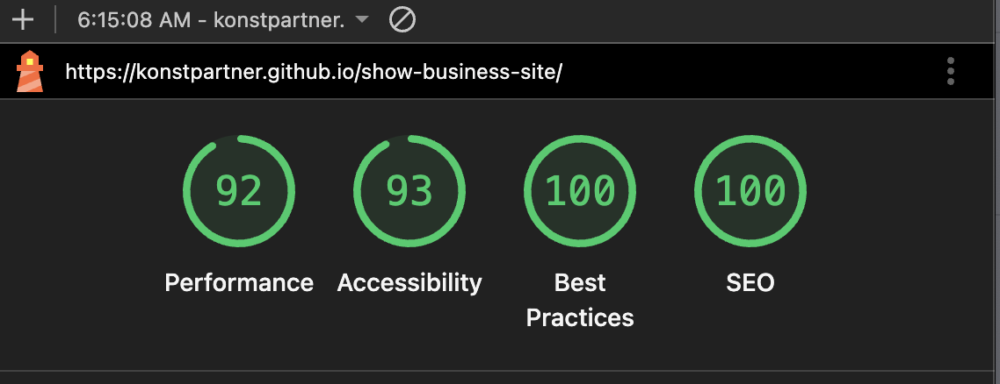
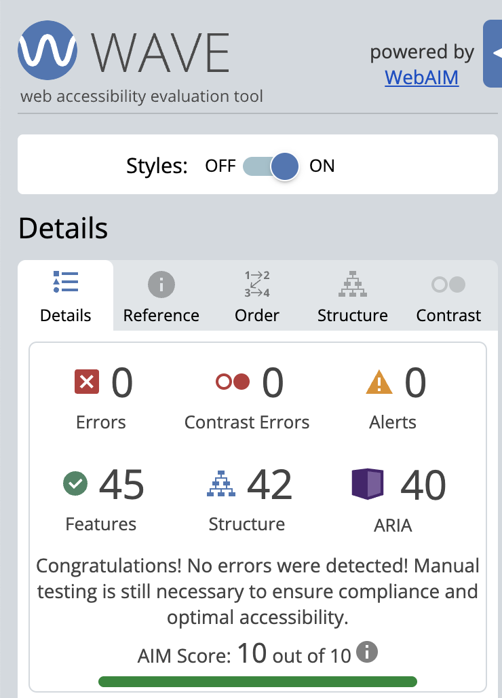
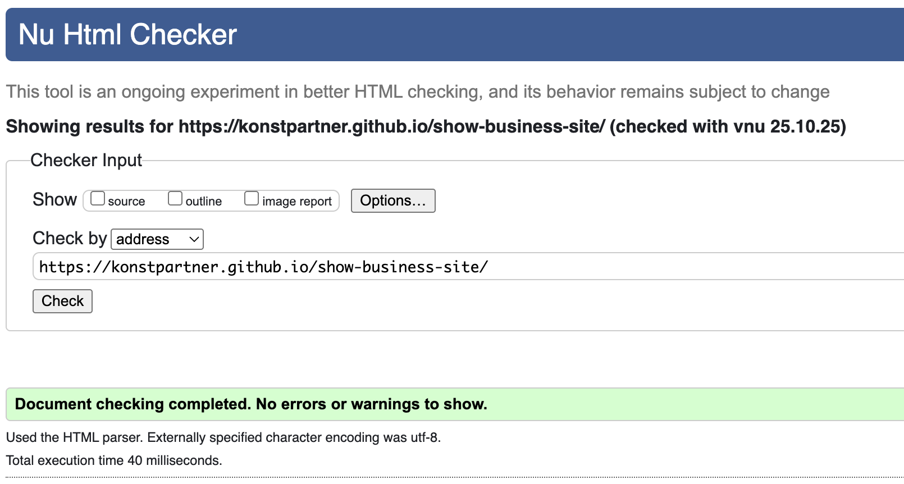

# Show Business Website

A responsive **pixel-perfect** website built without frameworks, using **HTML**, **SCSS**, and **JavaScript** with **Vite** as the bundler.  
The project follows the **BEM methodology** for structured and maintainable code.

---

## Links

Live Demo: [github.io/show-business-site/](https://konstpartner.github.io/show-business-site/)

Figma Design: [figma.com](https://www.figma.com/design/FXH4IrR8Vho44BpcloBNfc/DEMO-for-Dima-Bukovsky?node-id=0-1&p=f&t=XYmzfY9ApCcgo5Bb-0)

---

## Features

- Fully responsive layout (mobile, tablet, desktop)
- Pixel-perfect implementation according to Figma design
- SCSS architecture with partials and variables
- BEM-based class naming convention
- Accessibility (WAVE / Axe) and HTML/CSS validation (W3C Validator)
- Passed **Lighthouse** checks — ≥90 in _Performance_, _Accessibility_, _Best Practices_, and _SEO_

---

## Project Setup

Clone the repository and install dependencies:

```bash
npm install
```

Build for Production and Start Website

```bash
npm run build

npm start
```

---

## Checks

### Lighthouse Report



### Accessibility Checks



### HTML/CSS Validation


